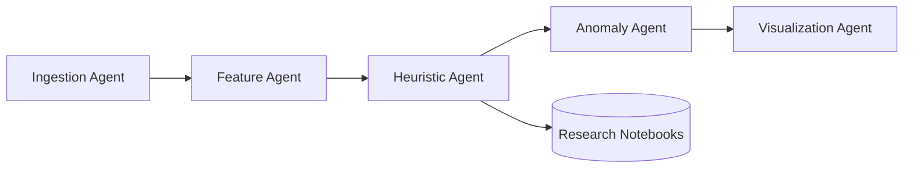

# Autonomous Agent Roles

This repository is structured around five cooperating agents. Each agent can be run manually
(via the CLI modules) or orchestrated by an automation framework.

## Ingestion Agent
- **Entry point**: `hei_seti.data_sources.HeasarcFetcher`
- **Inputs**: catalog names, HEASARC TAP endpoint, optional filters.
- **Outputs**: unified `pandas.DataFrame` with provenance column `_source_table`.
- **Notes**: Implements retry-aware queries, logs record counts, and persists raw tables
  under `data/`.

## Feature Agent
- **Entry point**: `hei_seti.features.FeatureBuilder`
- **Inputs**: raw catalog dataframe, configuration for column mappings.
- **Outputs**: normalized feature table with standardized columns
  (`flux`, `hardness`, `period`, `bh_mass`, `var_ratio`).
- **Notes**: Performs type coercion, handles missing values, logs summary statistics.

## Heuristic Agent
- **Entry point**: `hei_seti.heuristics.KBarrowCalculator`
- **Inputs**: engineered features plus optional distance or variability measurements.
- **Outputs**: Kardashev (continuous) and Barrow (ordinal) estimates for each source.
- **Notes**: Encapsulates domain heuristics. Emits logging metadata for every computation
  batch to support audit trails.

## Anomaly Agent
- **Entry point**: `hei_seti.anomaly.AnomalyModel`
- **Inputs**: feature table with Kardashev/Barrow metrics, contamination rate, random seed.
- **Outputs**: trained Isolation Forest model plus anomaly scores for candidate ranking.
- **Notes**: Supports serialization with `joblib` and logs fit/score diagnostics.

## Visualization Agent
- **Entry point**: `hei_seti.cli` (`plot` command)
- **Inputs**: feature table, candidate shortlist, Matplotlib configuration.
- **Outputs**: `results/kb_space.png` plot summarizing K×B landscape.
- **Notes**: Keeps plotting optional to maintain compatibility with headless workflows.

## Agent Workflow

Each agent records structured logs defined in `src/hei_seti/logging_conf.py`. When executed
through the CLI, the default logging configuration uses JSON lines, simplifying downstream
log aggregation.
