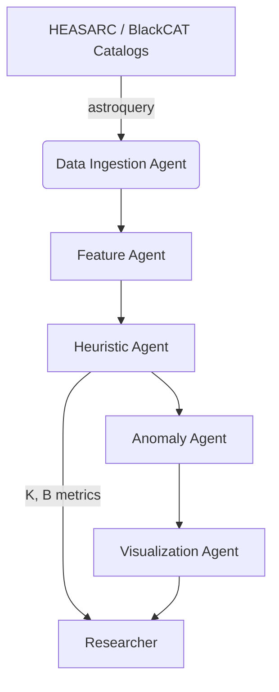

# hei-seti: High-Energy Astrobiology Toolkit

Operational toolkit inspired by Vidal (2011) *Black Holes: Attractors for Intelligence?*.
It provides a reproducible pipeline to retrieve X-ray binary (XRB) data, engineer
Kardashev–Barrow metrics, and highlight anomalous systems that could merit follow-up.

> **Disclaimer**: This repository is research-oriented. It does not claim detections of
> technosignatures; it provides tools to explore the hypothesis with rigor and transparency.

## Architecture at a glance



## Key capabilities

- Fetches XRB metadata from HEASARC catalogs using `astroquery`.
- Normalizes heterogeneous catalog fields into a consistent feature table.
- Computes Kardashev (K) and Barrow (B) scale proxies following Vidal (2011) heuristics.
- Trains an Isolation Forest anomaly detector to surface outliers in K×B space.
- Offers a CLI and modular Python API with structured logging for reproducibility.
- Ships with Docker and pytest-based CI for easy deployment and validation.

## Installation

### From source

```bash
python -m pip install --upgrade pip
python -m pip install .
```

For development work:

```bash
python -m pip install -e .[dev]
```

### Docker

Build and run within a container that includes system dependencies for `astropy`,
`astroquery`, `scikit-learn`, and `lightkurve`:

```bash
docker compose -f docker/docker-compose.yaml build
# Example: fetch and featurize data inside the container
mkdir -p data models results
docker compose -f docker/docker-compose.yaml run --rm hei-seti fetch
```

The compose file mounts `./data`, `./models`, and `./results` into the container for
artifact persistence.

## Quickstart CLI

```bash
# Step 1: fetch multiple HEASARC tables
hei-seti fetch --tables xrbcatalog hmxbcat2 lmxbcatalog

# Step 2: engineer features and Kardashev/Barrow proxies
hei-seti featurize --in data/raw.parquet --out data/features.parquet

# Step 3: train anomaly detector and score candidates
hei-seti train --features data/features.parquet --out models/iforest.joblib
hei-seti score --model models/iforest.joblib --top 25 --out results/candidates.csv

# Optional: visualize the KB space
hei-seti plot --features data/features.parquet --candidates results/candidates.csv
```

## Kardashev & Barrow scales

- **Kardashev**: continuous interpolation following Sagan `(log10 P - 6)/10` where `P` is
  total power in watts. When distances are unknown, the toolkit uses scaled flux as a
  proxy to maintain comparability across sources.
- **Barrow**: ordinal scale capturing inward manipulation capabilities. Observables such as
  estimated black-hole mass, hardness variability, and flux excursions map to proxies for
  Barrow levels `BI` through `Bω`.

## Configuration

Default configuration is stored in `configs/default.yaml`. Customize catalogs, feature
columns, and anomaly detector hyperparameters by providing your own YAML file and pointing
pipeline or CLI commands to it via the `--config` option.

## Development workflow

1. Install dev dependencies: `pip install -e .[dev]`
2. Run linters and tests: `ruff check .` and `pytest`
3. Submit pull requests with passing CI. GitHub Actions workflow ensures style and tests run
   for every push/PR.

## Citation

If this toolkit contributes to your research, please cite:

```
Vidal, C. (2011). Black Holes: Attractors for Intelligence?. Journal of Consciousness Studies, 18(2), 3-4.
```

## License

MIT License © atorsvn

